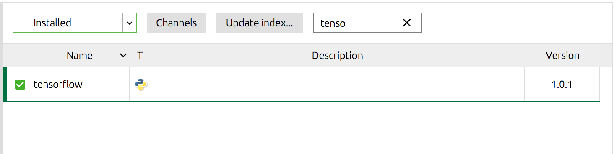

# Tensor Fun
Just some experimenting with tensor flow from Campus workshop.

# Getting Tensor Flow to work in Anconda Jupyter Notebook
I've found the only way to install tensorflow to work within a jupyter notebook (managed by anaconda) is to do an inline pip install within the notebook.

```python
import pip
pip.main(['install', 'tensorflow'])
```

This only needs to be done once, and can be done in a separate notebook.
Once it is done, 'tensorflow' will finally show inside Anaconda as an installed package and will work inside of Jupyter Notebooks managed by Anaconda.



# Resource
https://codelabs.developers.google.com/codelabs/cloud-tensorflow-mnist/#0
